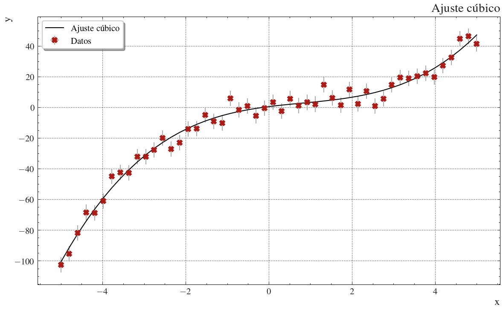

# Modelo-Ajustes

Repositorio con funciones básicas para ajustes de datos con incertidumbres asociadas y visualización de resultados.

## Estructura

- `fittools/` : Módulos principales
  - `data_frames.py` : Manejo de DataFrames y conversión a arrays con incertidumbres.
  - `funciones.py` : Funciones matemáticas y ajuste ODR.
  - `fit_result.py` : Clase para almacenar resultados de ajuste.
  - `graficos.py` : Clase para generar figuras y subplots.
  - `_decoradores.py` : Decoradores para manejo de excepciones.

- `Datos/` : Datos de ejemplo (`demo_cubica.csv`).
- `Imagenes/` : Gráficos generados (`Ajuste cúbico.png`).
- `Tests/` : Tests unitarios para cada módulo.
- `Notas/` : Documentación de cada módulo en markdown.
- `main.py` : Demo completa del proyecto.

## Ejemplo de salida

``` text
################################
####  Resultado del ajuste  ####
################################
* Parámetros:
      - p1 = 0.4323 ± 0.96
      - p2 = 3.412 ± 0.55
      - p3 = -1.092 ± 0.085
      - p4 = 0.4551 ± 0.033
* R² = 0.9831
* R² ajustado = 0.9816
* Motivo(s) de finalización:
      - Sum of squares convergence
################################
```



## Instalación y actualizaciones

### 1. Instalación clonando el repositorio (modo editable)

```bash
git clone https://github.com/tu_usuario/Modelo-Ajustes.git
cd Modelo-Ajustes
pip install -r requirements.txt
```

### 2. Instalación común (desde GitHub)

#### Para instalar, usar

```bash
pip install git+https://github.com/AguirreeLau/Modelo-Ajustes.git
```

#### Para actualizar, usar

```bash
pip install --upgrade git+https://github.com/AguirreeLau/Modelo-Ajustes.git
```

## Estado actual

Actualmente el proyecto está en estado preliminar, pueden implementarse muchas mejoras en las herramientas de la carpeta fittools, sin embargo, todas pueden utilizarse y aligeran bastantante el manejo de datos.
